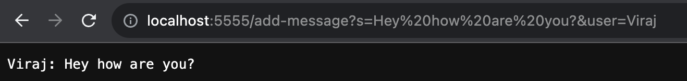

Below is the code for the StringServer as required in the lab report:
```
import java.io.IOException;
import java.net.URI;

class Handler implements URLHandler {
    // The one bit of state on the server: a number that will be manipulated by
    // various requests.
    String user;
    String message;
    String output;
    public String handleRequest(URI url) {   
            if (url.getPath().contains("/add-message")) {
                String[] parameters = url.getQuery().split("&");
                String[] messages = parameters[0].split("=");
                String[] users = parameters[1].split("=");
                if (parameters[0].contains("s=")) {
                    message = messages[1];
                    user = users[1];
                    output += user + ": " + message +"\n" ;
                }
                return output;

            }
            return "404 Not Found!";
        }
    }
class StringServer {
    public static void main(String[] args) throws IOException {
        if(args.length == 0){
            System.out.println("Missing port number! Try any number between 1024 to 49151");
            return;
        }

        int port = Integer.parseInt(args[0]);

        Server.start(port, new Handler());
    }
}
